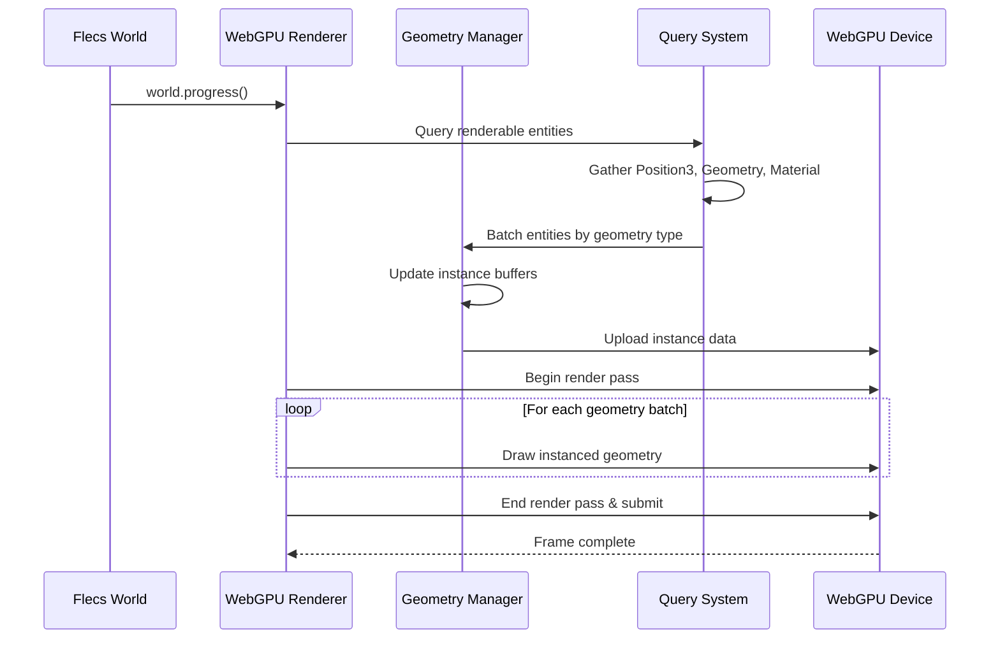
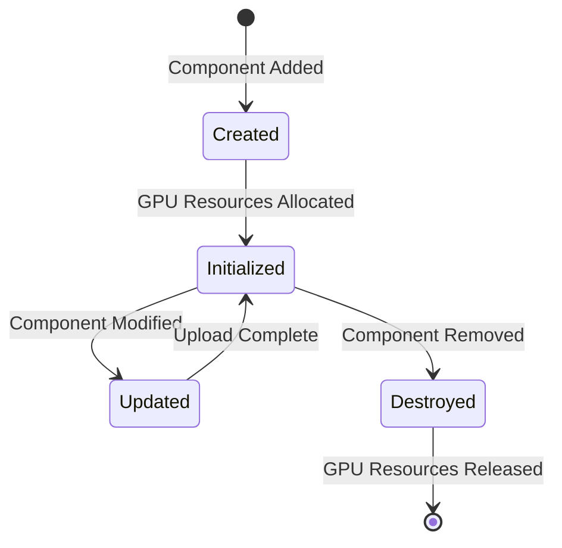

# Architecture Overview

This document details the technical architecture of the Flecs WebGPU rendering system. The design prioritizes web deployment performance while maintaining compatibility with existing Flecs patterns and components.

## Design Principles

The architecture addresses several critical requirements for modern web-based game development:

**Web-Native Performance**
WebGPU provides significantly better performance characteristics than WebGL for modern graphics workloads. The system is designed specifically for WebGPU capabilities rather than being a port of existing WebGL-based solutions. This includes native support for compute shaders, better resource management, and more efficient command submission patterns.

**ECS Integration**
Rather than treating rendering as an external system, the architecture integrates directly with Flecs query patterns. Components drive rendering decisions, and the system automatically discovers and batches entities based on their component composition. This eliminates the need for explicit render calls or scene graph management.

**Scalable Performance**
The rendering pipeline is designed to handle both simple prototypes and complex production scenes efficiently. Automatic instancing ensures that scenes with many similar entities (common in games) render with minimal draw calls. Resource management prevents allocation overhead during frame rendering.

**Modular Implementation**
Features are implemented as separable modules that can be enabled independently. Core geometry rendering works without advanced lighting, materials can be added without breaking existing code, and post-processing effects are entirely optional. This allows applications to ship with only the features they actually use.

## System Architecture

The system is organized into several specialized modules:

**Core Renderer**: Manages WebGPU device initialization, command buffer recording, and frame orchestration. Handles the main rendering loop and coordinates between other modules.

**Geometry Manager**: Responsible for vertex buffer management, primitive generation, and automatic instancing. Converts Flecs component data into GPU-compatible formats.

**Resource Manager**: Handles GPU resource allocation, texture loading, shader compilation, and pipeline state management. Provides efficient resource pooling and caching.

**Query System**: Integrates with Flecs queries to discover renderable entities and batch them by component type. Manages the mapping between ECS components and GPU resources.

**Web Integration**: Provides browser-specific functionality including canvas management, async resource loading, and performance monitoring integration.

## Component Architecture

The rendering system extends the existing Flecs component ecosystem with GPU-specific components. These components integrate seamlessly with existing Flecs Hub modules while providing the necessary GPU resource management.

### Primary Components

#### WebGPURenderer
```c
typedef struct {
    // WebGPU Core
    WGPUDevice device;
    WGPUQueue queue;
    WGPUSurface surface;
    
    // Rendering State
    ecs_query_t *geometry_query;    // Query for renderable entities
    ecs_vec_t render_batches;       // Batched rendering operations
    
    // Resource Management
    webgpu_resource_pool_t *resources;
    webgpu_shader_cache_t *shaders;
    
    // Frame State
    WGPUCommandEncoder command_encoder;
    uint32_t frame_index;
} WebGPURenderer;
```

#### WebGPUGeometry  
```c
typedef struct {
    // Geometry Buffers
    WGPUBuffer vertex_buffer;
    WGPUBuffer index_buffer;
    WGPUBuffer instance_buffer;
    
    // Instance Management
    ecs_allocator_t *allocator;
    ecs_vec_t transform_data;       // mat4 transforms
    ecs_vec_t material_data;        // Material properties
    ecs_vec_t color_data;          // Per-instance colors
    
    // Rendering Properties
    uint32_t vertex_count;
    uint32_t index_count;
    uint32_t instance_count;
    
    // GPU State
    WGPURenderPipeline pipeline;
    WGPUBindGroup bind_group;
} WebGPUGeometry;
```

#### WebGPUMaterial
```c
typedef struct {
    // PBR Properties
    float base_color[4];
    float metallic;
    float roughness;
    float emissive_factor;
    
    // Textures
    WGPUTexture diffuse_texture;
    WGPUTexture normal_texture;
    WGPUTexture material_texture;  // Metallic/roughness/occlusion
    
    // GPU Resources
    WGPUBindGroup material_bind_group;
    WGPUSampler texture_sampler;
} WebGPUMaterial;
```

## 🔄 System Flow

### Frame Rendering Pipeline



### Resource Lifecycle



## Query Integration

### Dynamic Query Construction

Following the Sokol pattern, queries are constructed dynamically based on available geometry components:

```c
// Base query for all renderable entities
ecs_query_desc_t base_desc = {
    .terms = {{
        .id = ecs_id(EcsTransform3),    // Required transform
        .inout = EcsIn
    }, {
        .id = ecs_id(EcsRgb),          // Required color
        .inout = EcsIn
    }, {
        .id = ecs_wildcard(),          // Any geometry component
        .second = ecs_id(EcsGeometryBase),
        .inout = EcsIn
    }}
};

// Specialized queries per geometry type
foreach_geometry_component(component_id) {
    ecs_query_desc_t specialized = base_desc;
    specialized.terms[2].id = component_id;  // EcsBox, EcsRectangle, etc.
    
    geometry_queries[component_id] = ecs_query_init(world, &specialized);
}
```

### Efficient Batching Strategy

```c
void webgpu_gather_render_batches(WebGPURenderer *renderer) {
    ecs_vec_clear(&renderer->render_batches);
    
    // Iterate through each geometry type query
    for (int i = 0; i < renderer->geometry_type_count; i++) {
        ecs_iter_t it = ecs_query_iter(world, renderer->geometry_queries[i]);
        
        while (ecs_query_next(&it)) {
            // Create render batch for this geometry type
            webgpu_render_batch_t *batch = ecs_vec_append_t(
                NULL, &renderer->render_batches, webgpu_render_batch_t);
                
            batch->geometry_type = i;
            batch->instance_count = it.count;
            
            // Extract component data for GPU upload
            batch->transforms = ecs_field(&it, EcsTransform3, 0);
            batch->colors = ecs_field(&it, EcsRgb, 1);
            batch->geometry_data = ecs_field(&it, void, 2);
        }
    }
}
```

## Web Integration Layer

### Canvas Management

```c
typedef struct {
    // HTML5 Canvas Integration
    const char *canvas_selector;    // CSS selector for canvas element
    uint32_t width, height;         // Current canvas dimensions
    float device_pixel_ratio;       // For high-DPI displays
    
    // WebGPU Surface
    WGPUSurface surface;
    WGPUSwapChain swap_chain;
    WGPUTextureFormat surface_format;
    
    // Event Handling
    bool size_changed;              // Resize detection
    bool focus_changed;             // Visibility API integration
} WebGPUCanvas;
```

### Async Resource Loading

```c
// Web-friendly async texture loading
typedef struct {
    ecs_entity_t entity;           // Target entity for texture
    char *url;                     // Image URL to load
    webgpu_texture_callback_t callback;
} webgpu_async_texture_request_t;

void webgpu_load_texture_async(const char* url, ecs_entity_t entity) {
    webgpu_async_texture_request_t *request = malloc(sizeof(*request));
    request->entity = entity;
    request->url = strdup(url);
    
    // Use Emscripten's async fetch API
    emscripten_async_wget_data(url, request, 
        webgpu_texture_loaded_callback, 
        webgpu_texture_error_callback);
}
```

## Performance Optimizations

The rendering system implements several optimization strategies to ensure competitive performance in web environments:

**GPU-Driven Rendering**
Entities with identical geometry types are automatically batched and rendered using instancing. This reduces the number of draw calls and minimizes CPU-GPU synchronization overhead. GPU buffers persist across frames and are only updated when component data changes, detected through Flecs change tracking.

**Memory Management**
The system uses custom allocators optimized for GPU resource patterns. Pool allocators handle frequent allocation/deallocation of temporary resources, while vertex and index buffers are shared across similar geometry types. Resource pooling prevents allocation overhead during frame rendering.

**Web-Specific Optimizations**
Critical rendering resources are loaded first to minimize startup time. Optional features can be delivered in separate WebAssembly modules to reduce initial download size. Canvas operations automatically handle device pixel ratio changes and resize events for responsive applications.

## Extension Points

### Custom Geometry Types

```c
// Plugin interface for custom geometry
typedef struct {
    ecs_entity_t component_id;           // Component type ID
    webgpu_generate_geometry_fn generate; // Vertex/index generation
    webgpu_populate_instances_fn populate; // Instance data population
    webgpu_create_pipeline_fn pipeline;   // Custom render pipeline
} webgpu_geometry_plugin_t;

void webgpu_register_geometry_plugin(webgpu_geometry_plugin_t *plugin);
```

### Custom Shaders

```c
// Shader plugin system
typedef struct {
    const char *name;                    // Shader identifier
    const char *vertex_wgsl;             // Vertex shader source
    const char *fragment_wgsl;           // Fragment shader source
    webgpu_bind_group_layout_t layout;   // Resource binding layout
} webgpu_shader_plugin_t;

void webgpu_register_shader(webgpu_shader_plugin_t *shader);
```

## Implementation Notes

The architecture balances performance requirements with implementation complexity. Critical rendering paths avoid memory allocations and minimize state changes. The plugin system allows applications to extend functionality without modifying core rendering code.

Component lifecycle management follows standard Flecs patterns, ensuring that GPU resources are properly allocated and deallocated in response to entity changes. The query-driven approach eliminates the need for explicit scene graph management while providing efficient batch processing of similar entities.

This design provides the foundation for production-quality web graphics applications while maintaining the development ergonomics that make Flecs an effective choice for game development.