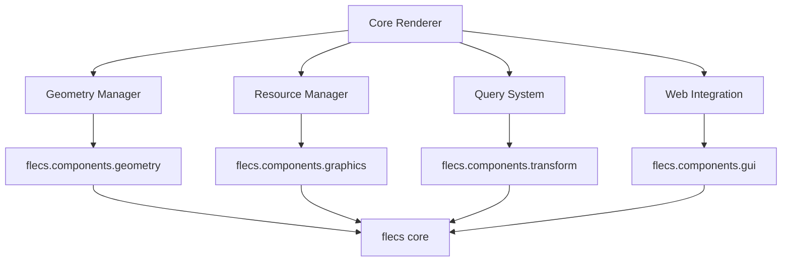
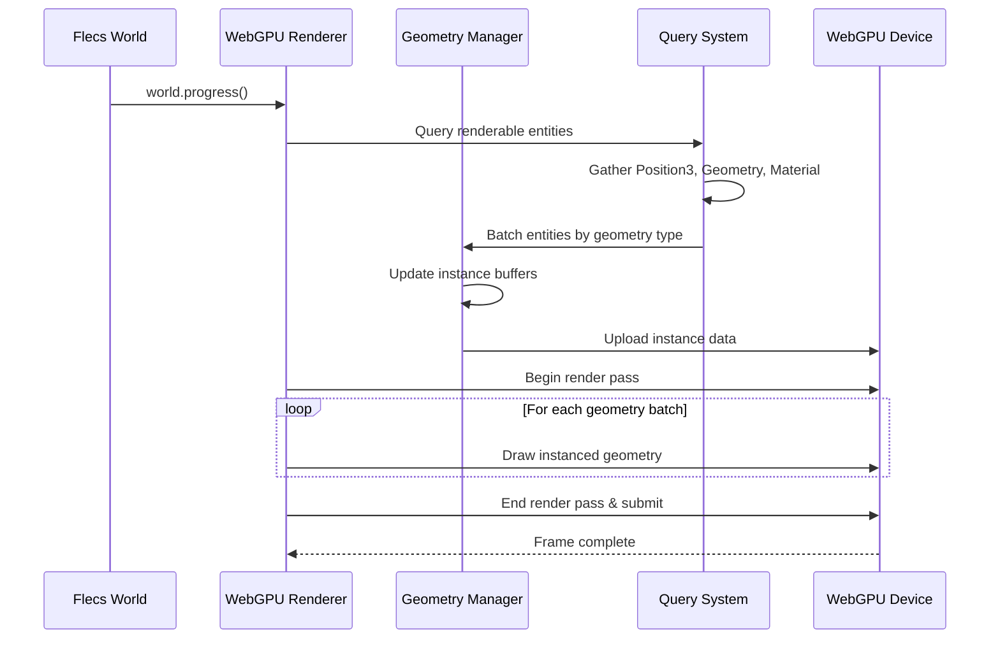
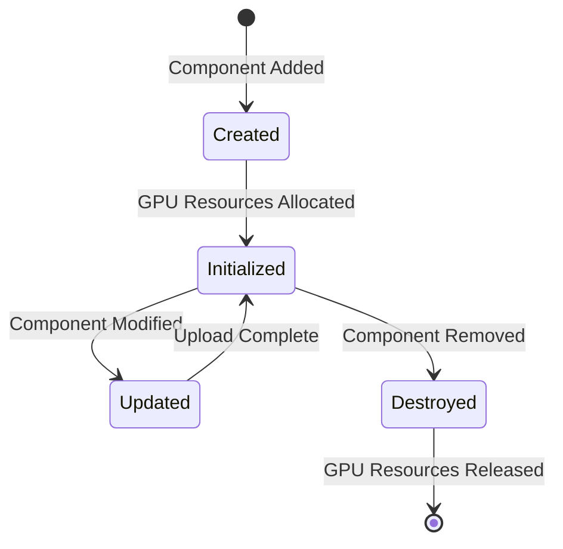

# Architecture Overview

This document outlines the technical architecture of the Flecs WebGPU rendering system, designed to provide optimal web performance while maintaining the simplicity and patterns of the existing Flecs ecosystem.

## 🎯 Design Principles

### 1. **Web-Native First**
- WebGPU as primary graphics API (no WebGL fallback)
- Optimized for browser performance and modern web standards
- Async resource loading and responsive canvas integration

### 2. **Flecs ECS Integration**
- Deep integration with Flecs query system
- Reuse existing Flecs Hub component definitions
- Follow established Flecs lifecycle and system patterns

### 3. **Performance by Design**
- Automatic instancing for identical geometry
- Efficient batching of rendering operations
- GPU-driven rendering with minimal CPU overhead

### 4. **Progressive Enhancement**
- Modular feature development (geometry → materials → effects)
- Optional advanced features that don't break basic usage
- Graceful degradation on less capable hardware

## 🏛️ System Architecture

### Core Modules

```
flecs-systems-webgpu/
├── Core Renderer        // WebGPU device & rendering orchestration
├── Geometry Manager     // Buffer management & primitive generation  
├── Resource Manager     // Textures, shaders, pipeline state
├── Query System        // Flecs integration & component gathering
└── Web Integration     // Canvas, async loading, browser APIs
```

### Module Dependencies



## 🔧 Component Architecture

### Primary Components

#### WebGPURenderer
```c
typedef struct {
    // WebGPU Core
    WGPUDevice device;
    WGPUQueue queue;
    WGPUSurface surface;
    
    // Rendering State
    ecs_query_t *geometry_query;    // Query for renderable entities
    ecs_vec_t render_batches;       // Batched rendering operations
    
    // Resource Management
    webgpu_resource_pool_t *resources;
    webgpu_shader_cache_t *shaders;
    
    // Frame State
    WGPUCommandEncoder command_encoder;
    uint32_t frame_index;
} WebGPURenderer;
```

#### WebGPUGeometry  
```c
typedef struct {
    // Geometry Buffers
    WGPUBuffer vertex_buffer;
    WGPUBuffer index_buffer;
    WGPUBuffer instance_buffer;
    
    // Instance Management
    ecs_allocator_t *allocator;
    ecs_vec_t transform_data;       // mat4 transforms
    ecs_vec_t material_data;        // Material properties
    ecs_vec_t color_data;          // Per-instance colors
    
    // Rendering Properties
    uint32_t vertex_count;
    uint32_t index_count;
    uint32_t instance_count;
    
    // GPU State
    WGPURenderPipeline pipeline;
    WGPUBindGroup bind_group;
} WebGPUGeometry;
```

#### WebGPUMaterial
```c
typedef struct {
    // PBR Properties
    float base_color[4];
    float metallic;
    float roughness;
    float emissive_factor;
    
    // Textures
    WGPUTexture diffuse_texture;
    WGPUTexture normal_texture;
    WGPUTexture material_texture;  // Metallic/roughness/occlusion
    
    // GPU Resources
    WGPUBindGroup material_bind_group;
    WGPUSampler texture_sampler;
} WebGPUMaterial;
```

## 🔄 System Flow

### Frame Rendering Pipeline



### Resource Lifecycle



## 🎮 Query Integration

### Dynamic Query Construction

Following the Sokol pattern, queries are constructed dynamically based on available geometry components:

```c
// Base query for all renderable entities
ecs_query_desc_t base_desc = {
    .terms = {{
        .id = ecs_id(EcsTransform3),    // Required transform
        .inout = EcsIn
    }, {
        .id = ecs_id(EcsRgb),          // Required color
        .inout = EcsIn
    }, {
        .id = ecs_wildcard(),          // Any geometry component
        .second = ecs_id(EcsGeometryBase),
        .inout = EcsIn
    }}
};

// Specialized queries per geometry type
foreach_geometry_component(component_id) {
    ecs_query_desc_t specialized = base_desc;
    specialized.terms[2].id = component_id;  // EcsBox, EcsRectangle, etc.
    
    geometry_queries[component_id] = ecs_query_init(world, &specialized);
}
```

### Efficient Batching Strategy

```c
void webgpu_gather_render_batches(WebGPURenderer *renderer) {
    ecs_vec_clear(&renderer->render_batches);
    
    // Iterate through each geometry type query
    for (int i = 0; i < renderer->geometry_type_count; i++) {
        ecs_iter_t it = ecs_query_iter(world, renderer->geometry_queries[i]);
        
        while (ecs_query_next(&it)) {
            // Create render batch for this geometry type
            webgpu_render_batch_t *batch = ecs_vec_append_t(
                NULL, &renderer->render_batches, webgpu_render_batch_t);
                
            batch->geometry_type = i;
            batch->instance_count = it.count;
            
            // Extract component data for GPU upload
            batch->transforms = ecs_field(&it, EcsTransform3, 0);
            batch->colors = ecs_field(&it, EcsRgb, 1);
            batch->geometry_data = ecs_field(&it, void, 2);
        }
    }
}
```

## 🌐 Web Integration Layer

### Canvas Management

```c
typedef struct {
    // HTML5 Canvas Integration
    const char *canvas_selector;    // CSS selector for canvas element
    uint32_t width, height;         // Current canvas dimensions
    float device_pixel_ratio;       // For high-DPI displays
    
    // WebGPU Surface
    WGPUSurface surface;
    WGPUSwapChain swap_chain;
    WGPUTextureFormat surface_format;
    
    // Event Handling
    bool size_changed;              // Resize detection
    bool focus_changed;             // Visibility API integration
} WebGPUCanvas;
```

### Async Resource Loading

```c
// Web-friendly async texture loading
typedef struct {
    ecs_entity_t entity;           // Target entity for texture
    char *url;                     // Image URL to load
    webgpu_texture_callback_t callback;
} webgpu_async_texture_request_t;

void webgpu_load_texture_async(const char* url, ecs_entity_t entity) {
    webgpu_async_texture_request_t *request = malloc(sizeof(*request));
    request->entity = entity;
    request->url = strdup(url);
    
    // Use Emscripten's async fetch API
    emscripten_async_wget_data(url, request, 
        webgpu_texture_loaded_callback, 
        webgpu_texture_error_callback);
}
```

## 🚀 Performance Optimizations

### GPU-Driven Rendering

- **Automatic Instancing**: Entities with identical geometry are batched automatically
- **Persistent Buffers**: GPU buffers persist across frames, only updated when needed
- **Change Detection**: Component modifications trigger selective buffer updates
- **Frustum Culling**: CPU-side culling before GPU submission

### Memory Management

- **Custom Allocators**: Pool allocators for frequent GPU resource allocation/deallocation
- **Buffer Reuse**: Vertex/index buffers shared across similar geometry types
- **Texture Atlasing**: Small textures combined to reduce draw calls
- **Resource Pooling**: WebGPU resources recycled to avoid allocation overhead

### Web-Specific Optimizations

- **Progressive Loading**: Critical rendering resources loaded first
- **Bundle Splitting**: Optional features delivered in separate WASM modules
- **Canvas Optimization**: Automatic handling of device pixel ratio and resize events
- **Performance Monitoring**: Integration with browser Performance API

## 🔌 Extension Points

### Custom Geometry Types

```c
// Plugin interface for custom geometry
typedef struct {
    ecs_entity_t component_id;           // Component type ID
    webgpu_generate_geometry_fn generate; // Vertex/index generation
    webgpu_populate_instances_fn populate; // Instance data population
    webgpu_create_pipeline_fn pipeline;   // Custom render pipeline
} webgpu_geometry_plugin_t;

void webgpu_register_geometry_plugin(webgpu_geometry_plugin_t *plugin);
```

### Custom Shaders

```c
// Shader plugin system
typedef struct {
    const char *name;                    // Shader identifier
    const char *vertex_wgsl;             // Vertex shader source
    const char *fragment_wgsl;           // Fragment shader source
    webgpu_bind_group_layout_t layout;   // Resource binding layout
} webgpu_shader_plugin_t;

void webgpu_register_shader(webgpu_shader_plugin_t *shader);
```

This architecture provides a solid foundation for high-performance web graphics while maintaining the elegant simplicity that makes Flecs ECS so powerful.